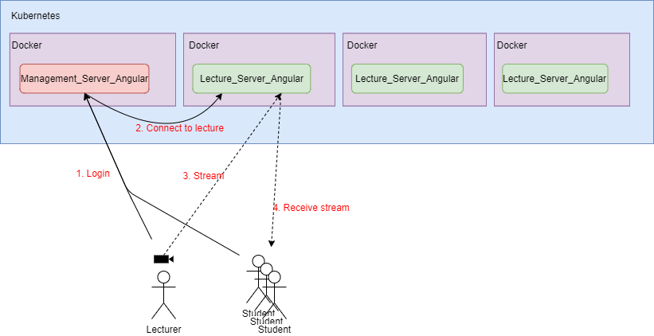

# Project Streaming Lectures

Goal is it to provide an easy to use and simple plattform to host lectures online.

Target is it to directly view the lecturers slides in the browser while the lecturer lectures. This makes the application a lot easier to develop, because we dont need to stream the lecture pages as video.
Also we dont need to demux or remux any video and audio. We can directly stream the video of the lecturer (hopefully) as it is comming from its camera.

---
## Plan



---
## [Lecture_Server_Angular](Lecture_Server_Angular/README.md)

The lecture server, or better, container will provide the platform for a single lecture. This means it hosts up to about 50 students and serves them the slides of the lecture and the stream of the lecturer. 

At a later phase this Angular server will be placed in a Docker container along with the needed tools like ```pdftk``` and ```exiftool``` to prepare the slides. Also some server logic for the stream of the lecturer is needed.

## Management_Server_Angular

The management server is used to manage the lifecycle of a lecture. It therefore starts a Dockercontainer, lets the lecturer and the students join to the container and ends the container.
Also the log in logic will be in here.

## Docker

Docker will be used as plattform for the Lecture_Server_Angular along with with the needed tools like ```pdftk``` and ```exiftool```. 

## Kubernetes

Kubernetes will be the plattform to spawn Dockercontainers and manage the connection to the lecture servers.

---
## Done
- ```exiftool -a -G1 "pdffile.pdf"``` tells the amount of pages in a pdf
-  ```pdftk``` splits the pdf site by site
- [Lecture_Server_Angular](Lecture_Server_Angular/README.md) can force a single pdf page to be viewn.
- [Lecture_Server_Angular](Lecture_Server_Angular/README.md) --> PDF pages can be selected via "next" and "previous"

## Unprocessed problems / questions
- Where does the video stream come from? (Webcam, camera, ??)
- Is it possible to stream the video stream coming via USB directly (not reencoded) to the server?
- Can the [plugin](https://github.com/videogular/videogular2) for the video player in the browser receive and decode the stream?
- How can I deliver the stream via the server to the clients?

- Where does the audio track come from?
- If external webcams are required, which ones? (Best with audio, or audio input, so that the audio gets directly encoded in the webcam stream)

- How to implement roles / login in Angular? (student, lecturer)

- Kubernetes, how does it work? (With Kubernetes you have to start the containers on which the lecture is running)

- How do I start a container from Angular and connect to it?

- CSS for the lecture overview and the lecture page (And the login page)


